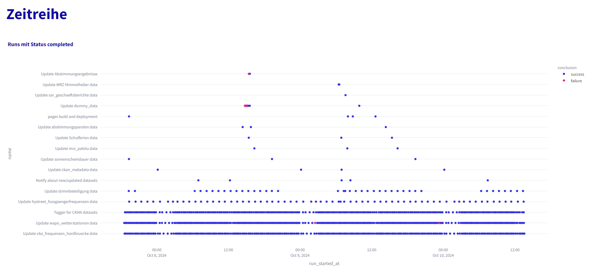

# Github Actions Monitor

Simple tool to monitor Github Actions workflows.

Uses [Github REST API endpoints for workflow runs](https://docs.github.com/en/rest/actions/workflow-runs?apiVersion=2022-11-28).

## Functionality

Overview over current status of all workflows (including status badge for last run).


Detailed information about single runs.




## Setup

- The app is realized in streamlit and can be run locally via: `python -m streamlit run actions_monitor.py`
- You need to create a [Github access token](https://docs.github.com/en/authentication/keeping-your-account-and-data-secure/managing-your-personal-access-tokens#creating-a-fine-grained-personal-access-token) which should have read-only access to your repository.
- For local testing you need to create a  `.streamlit/secrets.toml` file (see [Streamlit docs](https://docs.streamlit.io/deploy/streamlit-community-cloud/deploy-your-app/secrets-management)). The toml file contains the the access token an repo:

```

ACCESS_TOKEN = 'XXXXX'
REPO = 'opendatazurich/opendatazurich.github.io'
```
